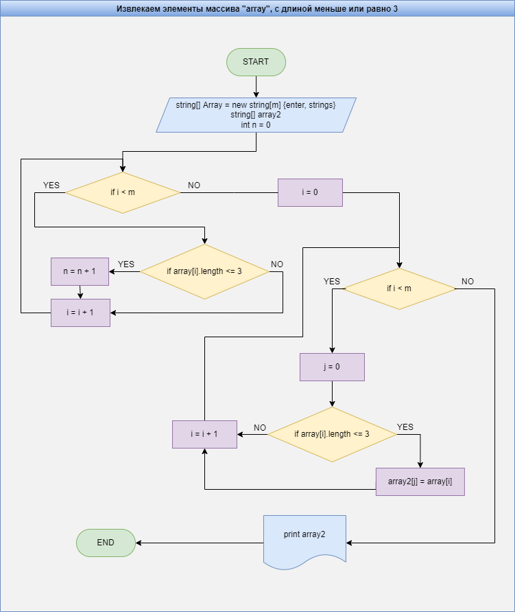

# Практическое задание по выбору специализации

## ЗАДАЧА
> Написать программу, которая из имеющегося массива строк формирует массив из строк, длина которых меньше либо равна 3 символам. Первоначальный массив можно ввести с клавиатуры, либо задать в начале алгоритма.

## Решение

### Блоксхема

> 1. Создаем первый массив с размерностью (m)
> 2. Проходим по всему массиву, для определения количества строк с длиной меньше или равно 3 (n)
> 3. Создаем второй массив с размерностью (n)
> 4. Проходим по первому массиву еще раз, но в этот раз, если длина текущей строки меньше или равно 3 то добавляем запись в массив 2.
> 5. Выводим второй массив на экран

Ссылка на репозиторий в github
https://github.com/Sergeykim486/PracticTask.git